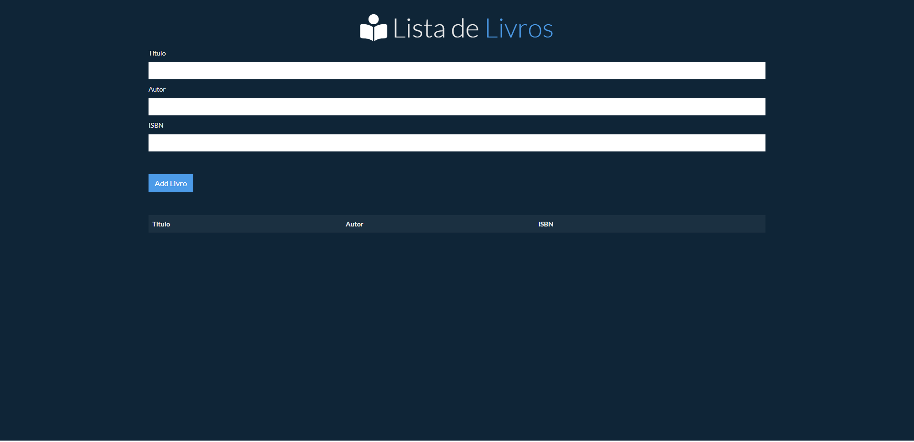

## 🖥️ Projeto
 O Projeto é uma página Web que Lista para exibir o cadastro de Livros

## 👨🏼‍💻 Tecnologias
Projeto desenvolvido utilizando as seguintes tecnologias HTML, CSS, Bootstrap, Git e GitHub

## Layout
Você pode visualizar o layout do projeto através [desse link](https://mathpisani.github.io/lista-de-livros)